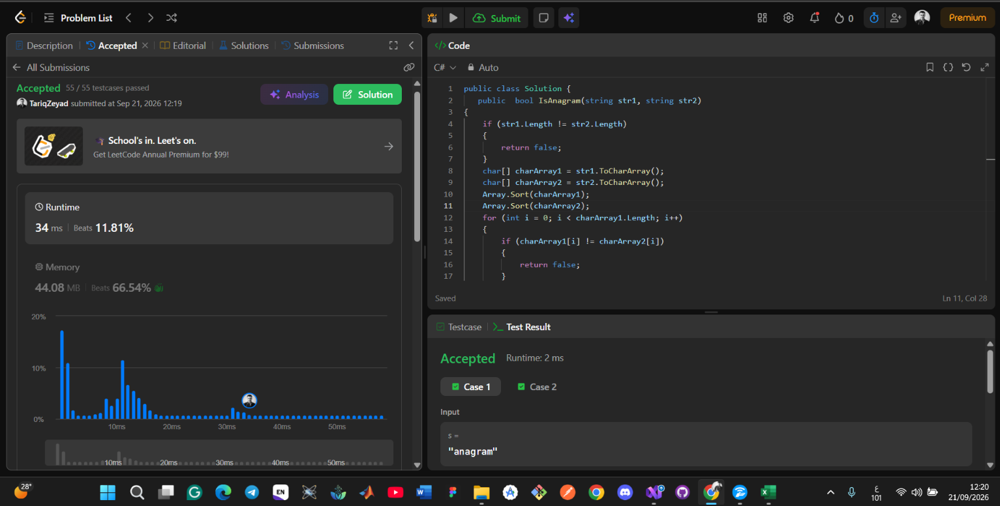
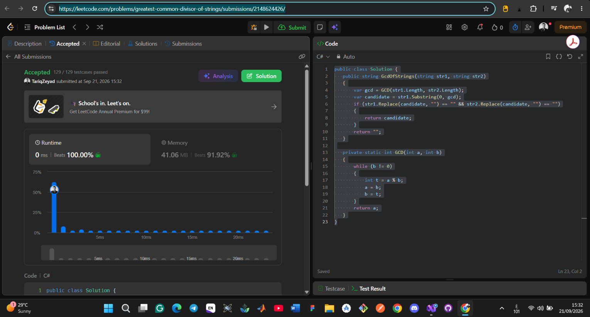

<div align="center">

# LeetCode Solutions

**C# Solutions • Practice • Problem Solving**

<p>
  <a href="https://leetcode.com/problems/valid-anagram/">
    
  </a>
  <a href="https://leetcode.com/problems/greatest-common-divisor-of-strings/">
    
  </a>
</p>

</div>

---

## 📌 About

This folder contains my solutions for the LeetCode problems required in the assignment.

I focused on keeping the solutions simple and understanding the main idea behind each problem.

---

# 1. Valid Anagram

<p>
  <a href="https://leetcode.com/problems/valid-anagram/">
    🔗 <strong>Problem</strong>
  </a>
  &nbsp; • &nbsp;
  <a href="https://leetcode.com/problems/valid-anagram/submissions/2148478433/">
    ✅ <strong>Accepted Submission</strong>
  </a>
</p>

### 💡 Idea

The goal is to check if two strings contain the same characters with the same frequencies.

First, I check if the two strings have different lengths. If they do, they cannot be anagrams.

Then I use an integer array to count the characters.

* Increase the count for every character in the first string.
* Decrease the count for every character in the second string.
* If all counts are `0`, the strings are anagrams.

### 🧠 Hint

> Instead of comparing every character with every other character, think about how many times each character appears.

### ⏱️ Complexity

| Type  | Complexity |
| ----- | ---------- |
| Time  | `O(n)`     |
| Space | `O(1)`     |

The space is `O(1)` because the counting array always has a fixed size of 26 characters.

### 📸 Accepted Submission

<div align="center">



</div>

---

# 2. Greatest Common Divisor of Strings

<p>
  <a href="https://leetcode.com/problems/greatest-common-divisor-of-strings/">
    🔗 <strong>Problem</strong>
  </a>
  &nbsp; • &nbsp;
  <a href="https://leetcode.com/problems/greatest-common-divisor-of-strings/submissions/2148624426/">
    ✅ <strong>Accepted Submission</strong>
  </a>
</p>

### 💡 Idea

The goal is to find the largest string that can be repeated to build both input strings.

First, I calculate the GCD of the two string lengths.

Then I take the first `GCD` characters from `str1` as the candidate.

After that, I use `Replace` to remove the candidate from both strings.

If both strings become empty, the candidate can build both strings, so I return it. Otherwise, I return an empty string.

### 🧠 Hint

> Use the GCD of the two string lengths to find the possible size of the answer.

For example:

```text
str1 = ABCABC
str2 = ABC

Lengths = 6 and 3
GCD = 3

Candidate = ABC
```

`ABC` can be repeated to create both strings, so it is the answer.

### 🔢 GCD Function

I used the Euclidean algorithm to calculate the GCD:

```csharp
private static int GCD(int a, int b)
{
    while (b != 0)
    {
        int t = a % b;
        a = b;
        b = t;
    }

    return a;
}
```

The algorithm keeps calculating the remainder until `b` becomes `0`. The remaining value of `a` is the GCD.

### ⏱️ Complexity

| Type  | Complexity |
| ----- | ---------- |
| Time  | `O(n + m)` |
| Space | `O(n + m)` |

The additional space comes from creating new strings when using `Replace`.

### 📸 Accepted Submission

<div align="center">



</div>

---

# 📝 What I Practiced

| Problem        | Main Concept                              |
| -------------- | ----------------------------------------- |
| Valid Anagram  | Character frequency counting              |
| GCD of Strings | GCD, string patterns, and string division |

### Key Takeaways

* Working with strings in C#
* Using arrays for character counting
* Understanding time and space complexity
* Using the Euclidean algorithm
* Breaking a problem into smaller steps
* Testing solutions on LeetCode

---

<div align="center">

### 🚀 Keep Practicing

**Solve → Understand → Improve**

</div>
